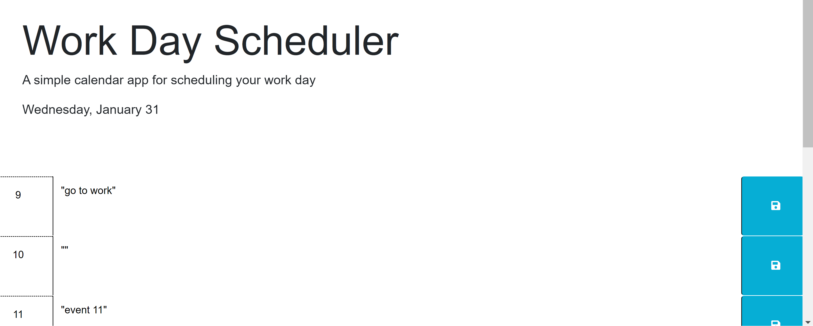

# Work-Day-Scheduler
## Description

This project demonstrated the use of jquery, day.js, and bootstrap to dynamically create and style content for a calendar website. It also demonstrates use of JSON and localStorage to store and retrieve information in the calendar app. 

## Installation

N/A: The project is a simple webpage that opens in a browser window.

## Usage

To use the website, enter text into the text boxes for a given hour of the day, and then hit save to save your calendar event.
 The website is accessible at the following URL: https://victoria-cg.github.io/Work-Day-Scheduler

 

## Credits

Day.js notation for date formatting: 

Day.js. (2024). Format. Day.js. Retrieved January 27, 2024, from https://day.js.org/docs/en/display/format

Syntax for sessionStorage loop, get item, and set item:

https://www.digitalocean.com/community/tutorials/js-introduction-localstorage-sessionstorage

Advice from Xpert AI:

-Corrected spelling and syntax for functions at JS line 60, correct use of ‘val’ method
-Corrected use of .val method at line 81 in renderSaved() function
-Corrected syntax for colorChange function

Advice from Ask BCS:
-JS line 60, corrected use of vanilla javascript to jquery. Helped with that syntax, use of “this” for DOM traversal

-Debugged syntax for colorChange and renderSaved functions in JS file

Collaboration/advice with class TA Walter Perry in office hours:

-Debugging and adding functions in JS line 61-79 to render localStorage correctly to the page
-Use of .each method in the colorChange function

README Template used to format this README file:

edX Boot Camps LLC. (2023, November 14). Professional README Guide | The Full-Stack Blog. GitHub Pages. Retrieved December 17, 2023, from https://coding-boot-camp.github.io/full-stack/github/professional-readme-guide

Starter code provided by EdX bootcamp for this assigment, as seen in initial commit including starter HTML, CSS, and JS files.

## License

MIT License, viewable in the page's repository at the following URL: https://github.com/victoria-cg/Work-Day-Scheduler 